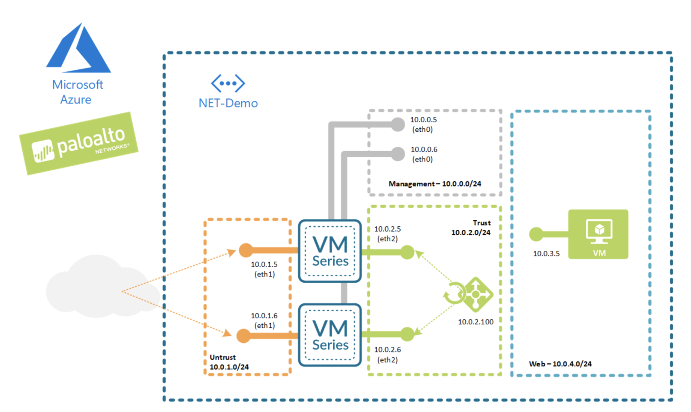

# Deploy Outbound protection using VM-Series on Azure

Prequisites:
- Create bootstrap fileshare on Azure
  - Extract the config files in "bootstrap.zip" and upload to the bootstrap fileshare
  - Create Access Key to allow VM-Series to access the Azure File Share during bootstrap process

Description:
- This skillet deploys two VM-Series Firewalls with a Standard Azure internal load-balancer, and an Ubuntu test VM, as shown in the diagram.
- 
